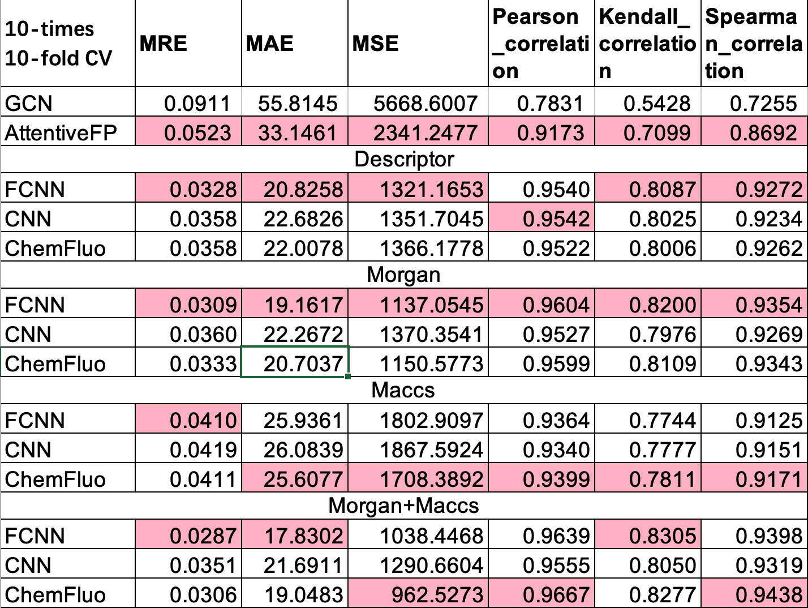

# PMAW
Source code of the paper "Prediction of Molecular Absorption Wavelength Using Deep Neural Networks"

**Jinning Shao<sup>1</sup>, Yue Liu<sup>1</sup>, Jiaqi Yan<sup>1</sup>, Ze-Yi Yan, Yangyang Wu, Zhongying Ru, Jia-Yu Liao\*, Xiaoye Miao\*, Linghui Qian\***



Installation

```
conda install --yes --file molfp_requirements.txt
```


