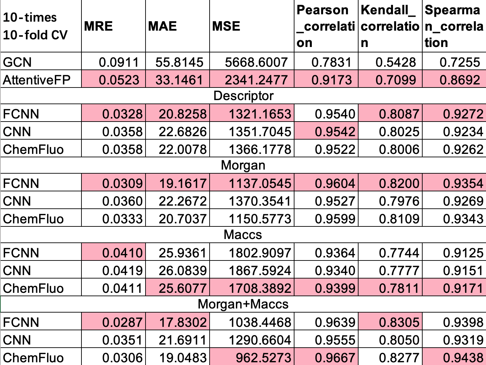

# PMAW
Source code of the paper "Prediction of Molecular Absorption Wavelength Using Deep Neural Networks"

**Jinning Shao<sup>1</sup>, Yue Liu<sup>1</sup>, Jiaqi Yan<sup>1</sup>, Ze-Yi Yan, Yangyang Wu, Zhongying Ru, Jia-Yu Liao\*, Xiaoye Miao\*, Linghui Qian\***



## Installation
For GCN and AttentiveFP, 
```
conda install --yes --file deepchem_requirements.txt
```

For other models (FCNN, CNN, Chemfluo),
```
conda install --yes --file molfp_requirements.txt
```

## Prepare data
Make sure your data format belongs to \{descriptor, morgan, maccs, smiles and morgan+maccs\}. In all formats, the first column should denote the true absorption wavelengths. For more details, please refer to our [data](https://github.com/yliuhz/PMAW/tree/main/src/data/database). 


## Inference
We didn't prepare the model weights here, since the model is lightweight and easy to train. You can now put arbitrary values in the first column of data. Suppose you have put the morgan data in /src/data/database. 
First, you should modify the data path [here](https://github.com/yliuhz/PMAW/blob/59f0ad91d6ac8f2ab27dc7d12cbdf5c198be1246/src/mlp_morgan_out.py#L77);
Then run 
```
python /src/mlp_morgan_out.py 
```

The inference result will be put in /src/Out/Large_MRE_out_points.csv

**Tips:** You may use mlp_descriptor_out.py for descriptor datasets, and et cetera.

## Train your own data
Suppose you hace put the morgan data in /src/data/database. You should modify the data path [here](https://github.com/yliuhz/PMAW/blob/59f0ad91d6ac8f2ab27dc7d12cbdf5c198be1246/src/mlp_morgan_out.py#L75). Besides, you may add your codes for saving the model weights [here](https://github.com/yliuhz/PMAW/blob/59f0ad91d6ac8f2ab27dc7d12cbdf5c198be1246/src/mlp_morgan_out.py#L165). 


